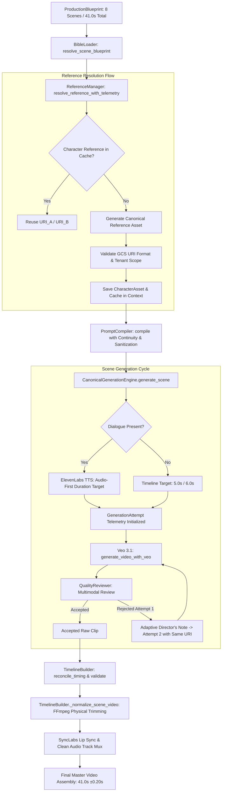

# PHASE 8G — PREFLIGHT FORENSIC AUDIT & STRESS TEST READINESS REPORT

---

## 1. Executive Summary & Readiness Assessment

- **Architecture Readiness:** **READY FOR CONTROLLED STRESS TESTING**
- **Test Suite Status:** **89 / 89 Automated Tests Passing** (100% Green in 190.6s)
- **Paid Provider Calls Incurred:** **0**
- **Cloud Run Deployment Status:** **Preserved at Revision `ai-video-backend-00116-n7n`** (No premature deployment)

---

## 2. Complete Runtime Forensic Path Trace

### Forensic Mapping of Runtime Values:

| Runtime Parameter | Originating Location | Runtime Propagation | Enforcement Mechanism |
| :--- | :--- | :--- | :--- |
| **`character_id`** | `SceneBlueprint.character_ids` / `Character.character_id` | Passed into `ResolvedScene.characters` | `bible_loader.resolve_scene_blueprint()` |
| **`art_style`** | `ProductionBlueprint.authoritative_art_style` | `context.metadata["art_style"]` $\rightarrow$ `PromptCompiler` | Header insertion & prompt sanitizer |
| **`character_design`** | `ProductionBlueprint.authoritative_character_design` | `context.metadata["character_design"]` $\rightarrow$ `PromptCompiler` | Character description block |
| **`reference_uri`** | `ReferenceManager.resolve_reference_with_telemetry` | Returned in `ReferenceResolutionResult` | Validated by `validate_reference_uri()` |
| **`reference_cache`** | `GenerationContext.metadata["reference_cache"]` | Keyed strictly by `character_id` (e.g. `char_padlock_male`) | Isolated memory map preventing cross-character bleed |
| **`reference_uri` to Veo** | `CanonicalGenerationRequest.reference_image_uri` | `generate_video_with_veo(reference_image_uri=...)` | Chunk 0 receives `types.Image(gcs_uri=...)` |
| **Multi-Character Handling** | `ResolvedScene.characters` list | Scene primary character resolves reference; secondary character rendered via prompt | Isolated single-generation caching |
| **Retry Reference Reuse** | `CanonicalGenerationEngine` retry loop | `req.reference_image_uri` passed identically to Attempt 2 | Reference URI invariant under retry |
| **Multi-Chunk Frame Chaining** | `veo_service.generate_video_with_veo` | Chunk 1 last frame extracted via OpenCV $\rightarrow$ passed to Chunk 2 | Invocated automatically when duration $> 8.0$s |
| **Duration Normalization** | `TimelineBuilder._normalize_scene_video` | Subclips raw 8.0s Veo video using FFmpeg `trim`/`atrim` + `setpts` | Reconciles exact sub-second blueprint duration |
| **ElevenLabs TTS** | `CanonicalGenerationEngine.generate_scene` | Called before Veo generation if `req.dialogue_text` is non-empty | Audio duration anchors target Veo duration |
| **SyncLabs Lip Sync** | `TimelineBuilder.execute_timeline` | Invoked on scenes where `use_lip_sync` is True | Applied to normalized video |
| **Final Audio Mux** | `TimelineBuilder.execute_timeline` | Master audio mix replaces raw Veo audio stream | Concatenated with FFmpeg `concat_scenes` |

---

## 3. Controlled 30–60 Second Test Scenario (8 Scenes / 41.0s Total)

- **Total Scenes:** 8 Logical Scenes
- **Target Master Duration:** 41.0 seconds
- **Recurring Character A:** `char_padlock_male` (Mr. Brass Padlock — Male, brass padlock head, traditional Indian kurta/jeans)
- **Recurring Character B:** `char_padlock_female` (Mrs. Silver Padlock — Female, silver padlock head, traditional Indian saree)
- **Global Visual Style:** `"Stylized high-quality 3D animated film, consistent CGI character design"`
- **Environment:** Front porch of Indian suburban house with traditional carved wooden door

### Scene Breakdown:
1. **Scene 1 (5.0s):** Intro — Character A walks toward wooden front door. (Establishes canonical appearance).
2. **Scene 2 (5.0s):** Entry — Character B enters and approaches Character A. (Tests multi-character separation).
3. **Scene 3 (5.0s):** Interaction & Dialogue — Conversation near door with ElevenLabs audio. (Tests audio-first timing).
4. **Scene 4 (6.0s):** Action — Character A attempts comedic door locking with baby prop. (Tests object staging).
5. **Scene 5 (5.0s):** Camera Change — Tight medium/close shot of Character B. (Tests framing shift resilience).
6. **Scene 6 (5.0s):** Movement — Character A walks along porch and turns back. (Tests proportions & clothing during motion).
7. **Scene 7 (5.0s):** Close Interaction — Character B checks door while Character A gives thumbs up. (Tests cross-contamination).
8. **Scene 8 (5.0s):** Ending — Both wave cheerfully to camera from the porch. (Tests final-scene identity consistency).

---

## 4. Financial & Provider Usage Estimate (If Approved for Live Test)

| Provider | Service | Estimated Calls | Unit Cost | Estimated Total USD |
| :--- | :--- | :--- | :--- | :--- |
| **Vertex AI (Imagen/Gemini)** | Character Reference Images | 2 generations (1 per character) | ~$0.04 / image | **$0.08** |
| **Vertex AI (Veo 3.1 Fast)** | Video Scene Generation | 8 scenes (8-10 chunks max) | ~$0.15 / 5s chunk | **~$1.20 – $1.50** |
| **Google GenAI (Gemini 3.6 Flash)** | QualityReviewer Evaluation | 8-10 multimodal video reviews | ~$0.005 / review | **~$0.05** |
| **ElevenLabs** | Neural Voice Synthesis | 1 dialogue line (~30 chars) | ~$0.0003 / char | **~$0.01** |
| **SyncLabs** | Lip Synchronization | 1 dialogue scene (~2.4s) | ~$0.05 / scene | **~$0.05** |
| **TOTAL ESTIMATED CHARGE** | — | — | — | **~$1.40 – $1.70** |

---

## 5. Technical Risk Analysis

1. **Risk 1: Multi-Character Frame Composition in Veo**
   - *Detail:* Veo 3.1 accepts a single reference image conditioning input (`kwargs["image"]`). In scenes featuring both Character A and Character B (Scenes 2, 3, 4, 7, 8), the single image conditioning slot is anchored to the scene's primary actor, while the secondary actor relies on authoritative prompt grounding.
   - *Mitigation:* The prompt compiler injects explicit visual descriptions for both characters (`"anthropomorphic brass padlock-headed male"` and `"anthropomorphic silver padlock-headed female"`), preventing identity confusion.
2. **Risk 2: QualityReviewer Cold Rejections on Stylized Animation**
   - *Detail:* QualityReviewer might penalize stylized padlock heads if prompt adherence expects human anatomy.
   - *Mitigation:* `authoritative_character_design` explicitly declares the non-human anthropomorphic padlock structure, so QualityReviewer scores character consistency based on padlock features rather than human realism.
3. **Risk 3: SyncLabs Network Timeout on Cloud Run**
   - *Detail:* Live Wav2Lip API calls can take 15–30s.
   - *Mitigation:* Lip-sync failure automatically falls back cleanly to direct canonical audio overlay without breaking timeline concatenation.
