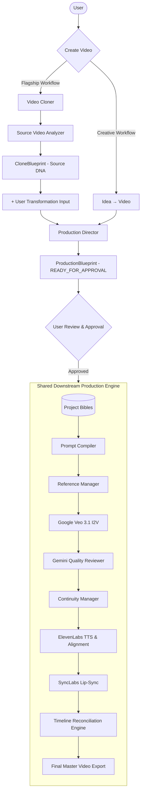

# PHASE 8 — VIDEO CLONER INTELLIGENCE + UNIFIED WORKFLOW
## Master Plan & Architectural Audit Document

---

## 1. High-Level Target Architecture

The unified production platform supports two distinct user entry paths while converging on a single, hardened downstream production engine:



---

## 2. Audit of Existing Video Cloner Implementation

### 2.1 Execution Flow in Current Codebase
1. **User Input (`POST /api/trend-cloner/analyze` in `routers/trend_cloner.py`):**
   * Accepts either an uploaded video file or a public social media URL (YouTube, TikTok, Instagram, Reels).
   * Downloads via `yt-dlp` or saves directly to `TEMP_DIR`.
2. **Vision Analysis (`services/trend_analyzer.py`):**
   * Transmits whole video bytes to Gemini 3.6 Flash using `types.GenerateContentConfig(response_schema=TrendAnalysis)`.
   * Extracts broad high-level style (`art_style`, `character_design`, `humor_mechanism`, `transcript_text`, `pacing_scenes`).
3. **Remixer (`services/trend_remixer.py`):**
   * Prompts Gemini to synthesize 3 concepts for a user-specified niche (e.g., "Finance", "Fitness", "Tech").
   * Each concept generates 2–5 `SceneBeat` items with prefixed `veo_prompt` strings.
4. **Character Seed (`core/character_refs.py`):**
   * Saves auto-generated `character_set_id` with `veo_prefix` in Firestore.
5. **Generation Dispatch (`POST /api/trend-cloner/generate`):**
   * Validates credits, plan limits, and approved blueprint status.
   * Dispatches `run_trend_cloner_job` background task.
6. **Production Execution (`run_trend_cloner_job`):**
   * ElevenLabs generates audio per scene.
   * Multi-scene Veo generation loop runs with single canonical I2V character reference.
   * Gemini Quality Reviewer reviews frames (capped at 1 retry).
   * Continuity Manager updates scene states.
   * TimelineBuilder reconciles durations and normalizes freeze-frames.
   * MoviePy / FFmpeg exports final video.

---

### 2.2 Source Video Analysis Capabilities Matrix

| Attribute | Status | Current Implementation / Source |
| :--- | :--- | :--- |
| **Duration** | `PARTIAL` | Estimated per scene by Gemini (`PacingScene.duration_seconds`). Exact container duration is not probed. |
| **Resolution** | `MISSING` | Not probed or stored during analysis. |
| **FPS** | `MISSING` | Not probed or stored during analysis. |
| **Aspect Ratio** | `PARTIAL` | Assumed to be 9:16 vertical in prompts and sanitization. |
| **Audio Track** | `MISSING` | No separate audio demuxing or background/speech separation. |
| **Dialogue** | `PARTIAL` | Extracted as single flat string (`transcript_text`) without word-level alignment. |
| **Speaker Diarization** | `MISSING` | No speaker identification; remixer arbitrarily assigns `"Male"`/`"Female"`. |
| **Scene Boundaries** | `PARTIAL` | Semantic scene breakdown generated by LLM (`pacing_scenes`); no exact cut timestamps. |
| **Shot Boundaries** | `MISSING` | PySceneDetect exists in `video_intelligence.py` for Repurposer, but is not used in Trend Cloner. |
| **Camera Movements** | `MISSING` | Not extracted from source (e.g., pan, tilt, tracking, dolly). |
| **Camera Angles** | `MISSING` | Not classified from source (e.g., wide, close-up, POV, low-angle). |
| **Characters** | `PARTIAL` | Single global text description (`character_design`); no multi-character segmentation. |
| **Locations** | `MISSING` | Not isolated as discrete location entities. |
| **Props** | `MISSING` | Not identified or cataloged. |
| **Visual Style** | `EXISTS` | Extracted as high-level string descriptor (`art_style`). |
| **Lighting** | `MISSING` | Not extracted as a structured parameter. |
| **Transitions** | `MISSING` | Cut types (cut, dissolve, whip pan, fade) are not classified. |
| **Pacing / Rhythm** | `PARTIAL` | Scene count and estimated durations extracted. |
| **Emotional Arc** | `MISSING` | Emotional progression across scenes is not tracked. |
| **Hook Structure** | `PARTIAL` | Implicitly captured inside `humor_mechanism` or scene 1 visual description. |
| **Call To Action (CTA)**| `MISSING` | Not isolated as a structured element. |
| **Background Music** | `MISSING` | Music tempo, genre, and mood are not extracted. |
| **Sound Effects (SFX)**| `MISSING` | SFX occurrences and cues are not analyzed. |

---

## 3. Structural Cloning Principles

Video Cloner operates on **Structural & Creative Transformation**, never literal duplication or copyright infringement:

```
┌────────────────────────────────────────────────────────┐
│                   STRUCTURAL CLONING                   │
├────────────────────────────┬───────────────────────────┤
│ WHAT WE CLONE (Structure)  │ WHAT WE TRANSFORM (New)   │
├────────────────────────────┼───────────────────────────┤
│ • Hook formula & timing    │ • Original storyline      │
│ • Narrative beat rhythm    │ • Character identities    │
│ • Camera motion & shot arc │ • Face, skin tone, hair   │
│ • Dialogue cadence/pacing  │ • Verbatim dialogue text  │
│ • Emotional intensity      │ • Background voice audio  │
│ • CTA structure            │ • Branded visuals & logos │
└────────────────────────────┴───────────────────────────┘
```

---

## 4. Blueprint Architecture & Data Models

### 4.1 CloneBlueprint (Source Video DNA)
Captures the structural formula of the source video without encoding user-specific characters:

```python
class CloneAudioProfile(BaseModel):
    has_speech: bool = True
    speech_tempo: Literal["SLOW", "MODERATE", "FAST", "RAPID"] = "MODERATE"
    has_background_music: bool = False
    music_mood: Optional[str] = None
    sfx_cues: List[str] = Field(default_factory=list)

class CloneNarrativeStructure(BaseModel):
    hook_type: str = Field(description="e.g. 'Visual Shock', 'Direct Question', 'Role Reversal'")
    hook_duration_seconds: float
    core_conflict: str
    climax_or_twist: str
    payoff_or_cta: Optional[str] = None
    humor_mechanism: Optional[str] = None

class CloneSceneBlueprint(BaseModel):
    scene_number: int
    source_start_seconds: float
    source_duration_seconds: float
    narrative_purpose: str = Field(description="e.g. 'Establish Hook', 'Escalate Panic', 'Reveal Punchline'")
    shot_type: Literal["ESTABLISHING", "WIDE", "MEDIUM", "CLOSE_UP", "EXTREME_CLOSE_UP", "OVER_SHOULDER", "POV"]
    camera_motion: Literal["STATIC", "TRACKING", "PAN", "TILT", "DOLLY", "ZOOM"]
    lens_language: Optional[str] = None
    lighting_tone: Optional[str] = None
    transition_in: Literal["CUT", "FADE", "DISSOLVE", "WHIP_PAN"] = "CUT"
    subject_action_type: str = Field(description="e.g. 'Character rushes into frame searching pockets'")
    pacing_intensity: Literal["LOW", "MEDIUM", "HIGH", "CLIMACTIC"] = "MEDIUM"
    dialogue_beats: List[CloneDialogueBeat] = Field(default_factory=list)
    requires_visual_continuity_to_next: bool = False

class CloneBlueprint(BaseModel):
    source_video_id: str
    clone_version: int = 1
    source_duration_seconds: float
    target_duration_seconds: float
    aspect_ratio: str = "9:16"
    visual_style_summary: str
    narrative_structure: CloneNarrativeStructure
    audio_profile: CloneAudioProfile
    scenes: List[CloneSceneBlueprint] = Field(default_factory=list)
    created_at: datetime.datetime
```

---

### 4.2 Blueprint Relationship & Semantic Boundary

| Dimension | `CloneBlueprint` | `ProductionBlueprint` |
| :--- | :--- | :--- |
| **Role** | Descriptive (What source video does) | Prescriptive (What our new video will produce) |
| **Character Identity** | Generic role (Protagonist, etc.) | Canonical ID (`CHAR_001` in Character Bible) |
| **Voice Identity** | Generic tempo/tone profile | Canonical Voice ID (`VOICE_001` in Voice Bible) |
| **Visual Style** | Source style summary | Project Style Bible ID (`STYLE_001`) |
| **Veo Prompt** | Abstract visual action | Model-ready compiled prompt |
| **Approval State** | N/A (Reference data) | Mandatory (`APPROVED` required for production) |
| **Execution** | Never directly executed | Authoritative driver for shared engine |

---

## 5. End-to-End Transformation Workflow

```
[SOURCE VIDEO]
      ↓
[Source Video Analyzer] (Gemini 3.6 Flash + PySceneDetect)
      ↓
[CloneBlueprint] (Source DNA: Hook, Camera, Pacing, Beats)
      ↓
[User Transformation Input] (Topic: "Losing Bitcoin wallet in cafe", Character: CHAR_001, Style: STYLE_001)
      ↓
[Production Director] (core/services/production_director.py)
   ├─ Ingests CloneBlueprint structure
   ├─ Resolves Project Bibles (CHAR_001, VOICE_001, STYLE_001)
   ├─ Replaces source subjects with Canonical Alex descriptors
   ├─ Maps shot pacing & camera directions into SceneBlueprints
   └─ Compiles ProductionBlueprint (Status: READY_FOR_APPROVAL)
      ↓
[User Reviews & Approves] (Status: APPROVED)
      ↓
[Shared Production Engine] (Veo + QualityReviewer + Continuity + ElevenLabs + TimelineBuilder)
      ↓
[FINAL MASTER VIDEO]
```

---

## 6. Shared Production Engine Components

Both **Video Cloner** and **Idea $\rightarrow$ Video** converge on the same downstream backend infrastructure:

1. **Project Bibles (`core/services/bible_loader.py`):** Canonical characters, voices, styles, locations, and props.
2. **Prompt Compiler (`core/services/prompt_compiler.py`):** Canonical hierarchy enforcement (`CANONICAL BIBLE > SCENE BLUEPRINT > SCENE STATE`).
3. **Reference Manager (`core/services/reference_manager.py`):** Single I2V character reference portrait.
4. **Veo Service (`services/veo_service.py`):** 1080p 30fps vertical video generation.
5. **Quality Reviewer (`core/services/quality_reviewer.py`):** Frame evaluation with `scene_quality_priority` (capped at 1 retry).
6. **Continuity Manager (`core/services/continuity_manager.py`):** Real post-generation state tracking.
7. **ElevenLabs TTS (`services/elevenlabs_service.py`):** Voice synthesis and dialogue timing.
8. **Lip-Sync Service (`services/lip_sync_service.py`):** SyncLabs wav2lip alignment.
9. **Timeline Builder (`core/services/timeline_builder.py`):** Duration reconciliation and multi-track audio mixing.
10. **Attempt Repository (`core/repositories/attempt_repo.py`):** Idempotent version-locked generation attempts.

---

## 7. Versioning & Cost Architecture

* **Clone Blueprint Versioning:** Re-analyzing a source video increments `clone_version` (`cl_xxx_v1`, `cl_xxx_v2`).
* **Production Blueprint Versioning:** Modifying parameters or prompts increments `blueprint_version` (`bp_xxx_v1`, `bp_xxx_v2`).
* **Job Immutability:** Generation jobs lock to `(blueprint_id, blueprint_version)` at job start. Mid-flight edits create new draft versions without altering running production.
* **Cost Estimations:** Clearly labeled as `ESTIMATE` on blueprints; actual billing is enforced at job dispatch via the credit pre-flight check.

---

## 8. Proposed API Specifications

```http
# 1. Source Video Analysis
POST /api/video-cloner/analyze
Content-Type: multipart/form-data
Body: file (binary) OR url (string), niche (string)
Response: CloneBlueprint (Source DNA)

# 2. Retrieve Clone Blueprint
GET /api/video-cloner/blueprints/{clone_blueprint_id}
Response: CloneBlueprint

# 3. Creative Transformation (Clone -> Production Blueprint)
POST /api/video-cloner/transform
Content-Type: application/json
Body: CloneTransformationRequest { clone_blueprint_id, project_id, new_topic, character_id, visual_style_id, voice_id, language }
Response: ProductionBlueprint (status: READY_FOR_APPROVAL)

# 4. Standardized Blueprint Approval
PUT /projects/{project_id}/blueprints/{blueprint_id}/status
Content-Type: application/json
Body: { "status": "APPROVED" }
Response: { "status": "APPROVED", "blueprint_id": "...", "blueprint_version": 1 }

# 5. Production Generation Dispatch
POST /api/trend-cloner/generate
Content-Type: application/json
Body: { "project_id": "...", "blueprint_id": "bp_xxx", "title": "..." }
Response: { "job_id": "job_xxx", "status": "processing", "credits_cost": 60 }
```

---

## 9. Future Frontend UX Architecture

```
[STEP 1: Create Video Modal]
  ├── "Clone a Viral Video" (Flagship Mode)
  └── "Create from Idea" (Creative Text-to-Video Mode)

[STEP 2: Source Video Ingestion]
  └── Drag-and-drop MP4/MOV or paste TikTok/Reels/Shorts link

[STEP 3: Source DNA Inspection]
  └── Interactive visual breakdown: Hook Formula, Scene Rhythm, Cinematography

[STEP 4: Creative Transformation Interface]
  ├── Story/Topic: [ "Losing Bitcoin hardware wallet in a cafe..." ]
  ├── Character: [ Select Alex from Project Bible ▼ ] or [ + Create Character ]
  ├── Visual Style: [ Keep Source Style ] or [ Select Anime / 3D Pixar ▼ ]
  └── Voice & Language: [ Select Hindi Voice ▼ ]

[STEP 5: Production Blueprint Review & Approval]
  └── Review generated shots, camera motions, and dialogue
  └── Click: [ Approve & Produce Video ]

[STEP 6: Real-Time Live Production Dashboard]
  └── Progress bar tracking Veo scene rendering, Quality Review, and Final Master Timeline
```

---

## 10. Phased Implementation Roadmap

```
PHASE 8A: SOURCE ANALYSIS NORMALIZATION
  • Create core/models/clone_blueprint.py
  • Upgrade services/trend_analyzer.py with structured CloneBlueprint output

PHASE 8B: CLONE BLUEPRINT REPOSITORY & STORAGE
  • Implement core/repositories/clone_blueprint_repo.py in Firestore
  • Support multi-revision storage (cl_xxx_v1, cl_xxx_v2)

PHASE 8C: PRODUCTION DIRECTOR TRANSFORMATION ENGINE
  • Add transform_clone_to_production() in core/services/production_director.py
  • Map CloneSceneBlueprint -> SceneBlueprint with Bible entity resolution

PHASE 8D: UNIFIED ROUTER & BACKWARD COMPATIBILITY
  • Wire /api/video-cloner/ endpoints in backend
  • Preserve existing legacy /api/trend-cloner/analyze routes

PHASE 8E: TEST SUITE & END-TO-END VALIDATION
  • Unit tests for CloneBlueprint schema
  • Transformation tests from CloneBlueprint to ProductionBlueprint
  • End-to-end approval gate and production simulation tests
```

---

## 11. File-by-File Implementation Plan

| Action | Target File | Purpose |
| :--- | :--- | :--- |
| **[NEW]** | `backend/core/models/clone_blueprint.py` | Pydantic data models: `CloneBlueprint`, `CloneSceneBlueprint`, `CloneNarrativeStructure`, `CloneAudioProfile` |
| **[NEW]** | `backend/core/repositories/clone_blueprint_repo.py` | Firestore repository for versioned `CloneBlueprint` documents |
| **[MODIFY]** | `backend/services/trend_analyzer.py` | Update `analyze_trend_video` to produce validated `CloneBlueprint` data |
| **[MODIFY]** | `backend/core/services/production_director.py` | Add `transform_clone_to_production()` converting `CloneBlueprint` $\rightarrow$ `ProductionBlueprint` |
| **[MODIFY]** | `backend/routers/director.py` | Add transformation route `POST /projects/{project_id}/clone-transform` |
| **[MODIFY]** | `backend/routers/trend_cloner.py` | Integrate with `CloneBlueprintRepository` while preserving legacy compatibility |
| **[NEW]** | `backend/tests/test_video_cloner_intelligence.py` | Complete test suite for analysis, transformation, entity binding, and versioning |
