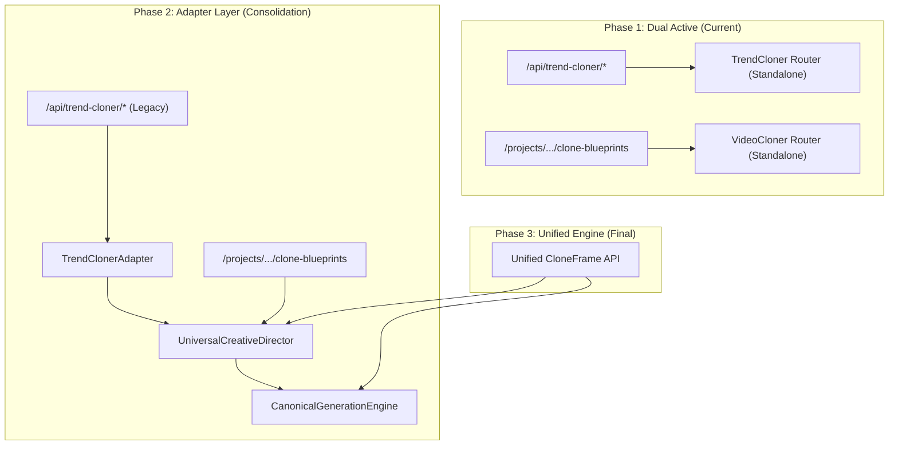

# TREND CLONER VS VIDEO CLONER MIGRATION MAP

**Objective:** Safely consolidate Trend Cloner and Video Cloner under `UniversalCreativeDirector` while maintaining 100% backward compatibility for legacy API routes.

---

## 1. Migration Phasing Strategy

---

## 2. Capability Mapping Matrix

| Legacy Trend Cloner Function | Video Cloner Phase 8 Equivalent | Unified Engine Canonical Handler | Migration Action |
| :--- | :--- | :--- | :--- |
| `download_video_yt_dlp` | `core.video_downloader.download_video` | `core.video_downloader.download_video` | Replace internal wrapper with direct shared utility. |
| `analyze_trend_video` | `SourceAnalyzer.run_source_analysis` | `UniversalSourceAnalyzer` (outputs `TrendDNA` + `SourceAnalysis`) | Map `TrendDNA` directly into `CloneBlueprint.trend_dna`. |
| `remix_trend` | `ProductionDirector.transform_clone_blueprint` | `UniversalCreativeDirector` (`story_mode=TREND_INSPIRED`) | Route through universal transformation pipeline. |
| `save_character_ref` | `VisualIdentityService` | `VisualIdentityService` + Firestore Project Bible | Migrate legacy file references into Project Bible character records. |
| `run_trend_cloner_job` | `video_cloner.run_production_job` | `CanonicalGenerationEngine` via Cloud Tasks | Dispatch to Cloud Tasks queue with deterministic idempotency. |

---

## 3. Legacy Route Compatibility Contract

The following endpoints remain fully operational without breaking changes for external clients:

1. **`POST /api/trend-cloner/analyze`**
   - **Input:** `url` or `file`, `niche`.
   - **Legacy Output:** `{"concepts": [...], "character_set_id": "..."}`.
   - **Adapter Execution:** Executes `UniversalSourceAnalyzer`, extracts `TrendDNA`, returns formatted concepts.

2. **`POST /api/trend-cloner/generate`**
   - **Input:** `GenerateRequest` (`scenes`, `title`, `script`, `character_set_id`, `blueprint_id`).
   - **Legacy Output:** `{"status": "processing", "job_id": "...", "credits_cost": ...}`.
   - **Adapter Execution:** Converts `GenerateRequest` to `CloneIntent` with `story_mode=TREND_INSPIRED`, creates `ProductionBlueprint`, reserves credits, and enqueues to Cloud Tasks.

3. **`GET /api/trend-cloner/status/{job_id}`**
   - **Input:** `job_id`.
   - **Legacy Output:** Standard Firestore job status document (`CREATED`, `RUNNING`, `COMPLETED`, `FAILED`).
   - **Adapter Execution:** Reads standardized Firestore job record directly.
