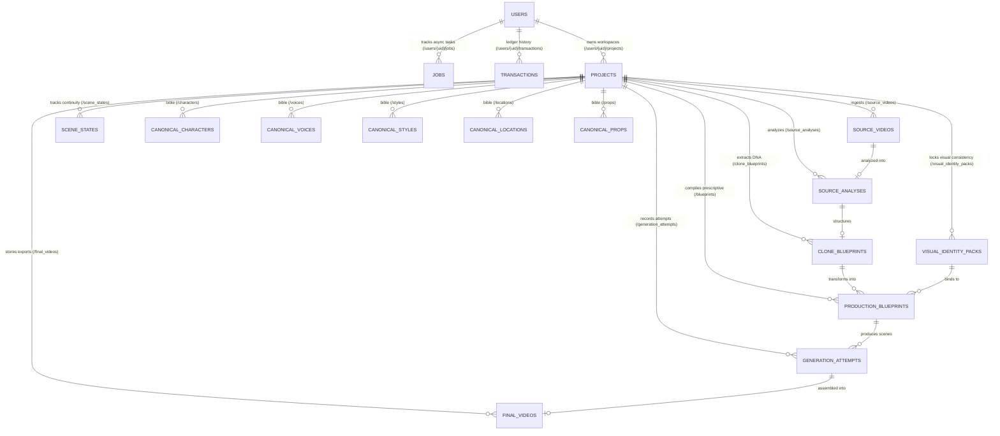

# Database Entity-Relationship Diagram (ERD) & Schema Specification
## ShortcutAI — Firestore NoSQL Architecture

This document specifies the complete Google Cloud Firestore data models, hierarchical collection paths, document schemas, and entity relationships implemented in the codebase.

---

## 1. High-Level Entity Relationship Diagram



---

## 2. Collection Hierarchy & Firestore Paths

All data in ShortcutAI is strictly scoped under individual user documents to guarantee **Multi-Tenant User & Project Isolation (Anti-IDOR)**.

```
/users/{user_id}
  ├── /jobs/{job_id}                                 (Legacy / Repurposer Job Tracking)
  ├── /transactions/{tx_id}                          (Credit Ledger & Billing History)
  └── /projects/{project_id}                         (Project Workspace)
        ├── /source_videos/{source_video_id}          (Source Video Ingestion Metadata)
        ├── /source_analyses/{analysis_id}           (Multimodal Structural Video Analysis)
        ├── /clone_blueprints/{clone_bp_id}_v{v}     (Versioned Clone Blueprints - Source DNA)
        ├── /visual_identity_packs/{pack_id}         (Visual Identity Packs for Characters/Environments)
        ├── /blueprints/{blueprint_id}_v{v}          (Versioned Production Blueprints)
        ├── /generation_attempts/{attempt_id}        (Per-Scene Model Telemetry & Reviewer Scores)
        ├── /scene_states/{scene_id}                 (Post-Generation Scene Continuity State)
        ├── /final_videos/{final_video_id}           (Final Rendered Master Media Records)
        ├── /characters/{character_id}               (Project Character Bible)
        ├── /voices/{voice_id}                       (Project Voice Bible)
        ├── /styles/{style_id}                       (Project Visual Style Bible)
        ├── /locations/{location_id}                 (Project Location Bible)
        └── /props/{prop_id}                         (Project Prop Bible)
```

---

## 3. Detailed Entity Schemas

### 3.1 User Entity (`/users/{user_id}`)
The root identity document managed in conjunction with Firebase Authentication.
```json
{
  "user_id": "string (Firebase UID)",
  "email": "string",
  "plan": "string ('starter' | 'creator' | 'agency' | 'free')",
  "credits": "int (Current balance)",
  "created_at": "timestamp",
  "updated_at": "timestamp"
}
```

---

### 3.2 Visual Identity Pack (`/users/{user_id}/projects/{project_id}/visual_identity_packs/{pack_id}`)
Pre-computed asset collection enforcing shot-aware visual consistency across scenes.
```json
{
  "pack_id": "string",
  "project_id": "string",
  "created_at": "timestamp",
  "characters": {
    "{character_id}": {
      "master_sheet_uri": "string",
      "front_ref_uri": "string",
      "three_quarter_left_uri": "string",
      "closeup_ref_uri": "string",
      "full_body_ref_uri": "string",
      "wardrobe_ref_uri": "string"
    }
  },
  "environments": {
    "{location_id}": {
      "master_plate_uri": "string",
      "lighting_map_uri": "string",
      "time_of_day_variants": "Dict[str, string]"
    }
  },
  "props": {
    "{prop_id}": {
      "turnaround_sheet_uri": "string",
      "isolated_asset_uri": "string"
    }
  },
  "shot_reference_packs": {
    "{shot_id}": {
      "primary_reference_uri": "string",
      "shot_type": "string"
    }
  }
}
```

---

### 3.3 Production Blueprint (`/users/{user_id}/projects/{project_id}/blueprints/{blueprint_id}_v{version}`)
The authoritative, prescriptive instruction set driving the downstream generation engine.
```json
{
  "blueprint_id": "string (Prefix 'bp_')",
  "blueprint_version": "int",
  "project_id": "string",
  "status": "string ('DRAFT' | 'READY_FOR_APPROVAL' | 'APPROVED' | 'IN_PRODUCTION' | 'COMPLETED' | 'FAILED')",
  "source_clone_blueprint_id": "string (Optional)",
  "source_clone_blueprint_version": "int (Optional)",
  "visual_identity_pack_id": "string (Optional)",
  "use_lip_sync": "boolean (Optional, toggles Mode A vs Mode B)",
  "allow_lip_sync_fallback": "boolean (Optional)",
  "authoritative_art_style": "string",
  "authoritative_character_design": "string",
  "visual_style_profile": { "art_style": "string", "character_design": "string", "lighting_style": "string" },
  "target_duration_seconds": "float",
  "storyboard_shots": [
    {
      "shot_id": "string",
      "shot_type": "string",
      "duration": "float",
      "description": "string"
    }
  ],
  "scenes": [
    {
      "scene_id": "string",
      "scene_number": "int",
      "narrative_purpose": "string",
      "estimated_duration_seconds": "float",
      "action": "string",
      "emotion": "string",
      "environment": "string",
      "camera": {
        "shot_type": "string",
        "lens": "string",
        "camera_motion": "string",
        "angle": "string",
        "framing": "string",
        "depth_of_field": "string",
        "lighting": "string"
      },
      "scene_quality_priority": "string ('BALANCED' | 'CHARACTER_CRITICAL' | 'ACTION_CRITICAL' | 'VISUAL_QUALITY_CRITICAL')",
      "dialogue": [
        {
          "character_id": "string",
          "voice_id": "string",
          "text": "string"
        }
      ]
    }
  ],
  "quality_strategy": {
    "max_retries": 1,
    "min_overall_score": 7.0
  },
  "created_at": "timestamp",
  "updated_at": "timestamp"
}
```

---

### 3.4 Generation Attempt (`/users/{user_id}/projects/{project_id}/generation_attempts/{attempt_id}`)
Immutable forensic telemetry logging every single raw Veo generation attempt, prompt, reference URI, QualityReviewer score, and rejection reason.
```json
{
  "attempt_id": "string ('attempt_{blueprint_id}_{scene_id}')",
  "project_id": "string",
  "scene_id": "string",
  "attempt_number": "int (1 or 2)",
  "status": "string ('IN_PROGRESS' | 'COMPLETED' | 'REJECTED' | 'FAILED')",
  "prompt": "string (Full compiled Veo prompt with adaptive notes)",
  "reference_uri": "string (Legacy flat GCS reference image URI if used)",
  "reference_telemetry": {
    "reference_requested": "boolean",
    "reference_source": "string ('VISUAL_IDENTITY_PACK' | 'LEGACY_CACHE' | 'AD_HOC')",
    "reference_asset_id": "string",
    "reference_uri": "string",
    "reference_generation_status": "string ('SUCCESS' | 'FAILED')",
    "reference_validation_status": "string",
    "fallback_mode": "string"
  },
  "output_uri": "string (GCS URI of raw scene clip)",
  "score": "float (Overall QualityReviewer score, e.g. 7.75)",
  "quality_review": {
    "character_consistency": "float",
    "scene_adherence": "float",
    "visual_quality": "float",
    "continuity": "float",
    "overall": "float",
    "issues": ["string"],
    "recommended_action": "string ('accept' | 'reject')"
  },
  "rejection_reason": "string (Detailed error if rejected)",
  "blueprint_id": "string",
  "blueprint_version": "int",
  "created_at": "timestamp"
}
```

---

### 3.5 Final Video Record (`/users/{user_id}/projects/{project_id}/final_videos/{final_video_id}`)
Persisted metadata for fully assembled, verified master videos.
```json
{
  "final_video_id": "string (Prefix 'fv_')",
  "user_id": "string",
  "project_id": "string",
  "source_video_id": "string",
  "source_clone_blueprint_id": "string",
  "source_clone_blueprint_version": "int",
  "production_blueprint_id": "string",
  "production_blueprint_version": "int",
  "output_uri": "string (GCS Master MP4 URL)",
  "duration_seconds": "float (Exact verified master duration)",
  "created_at": "timestamp"
}
```
